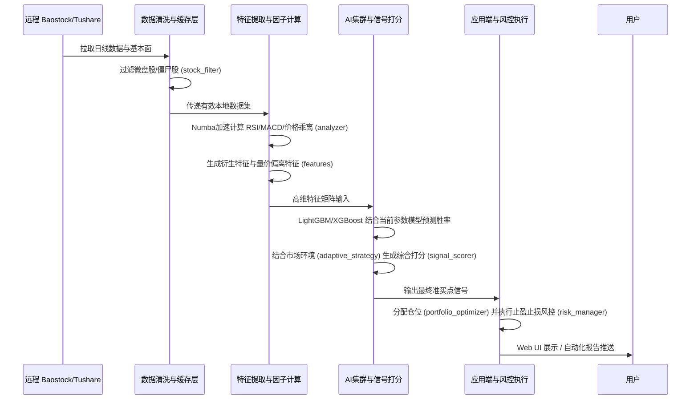

# 🚀 A股自动化量化分析与交易引擎 (开源增强版)

本工程是一个**全闭环**的 A 股量化交易与分析系统。它集成了数据清洗、因子多维计算、策略回测、K线形态识别、AI胜率预测评估、多模型集成学习、压力测试、投资组合优化以及基于贝叶斯/CMA-ES算法的自动参数调优。

无论您是刚入门量化的普通交易者，还是希望构建自演进模型的高级开发者，本系统都能为您提供开箱即用的生产级能力。

---

## 一、 系统架构概览与数据流

本系统从底层数据采集到上层应用展示，采用严谨的**四层架构**横向展开，保障了高内聚与低耦合，易于核心算法的剥离和二次开发。

### 1. 系统四层架构图 (Layered Architecture)

```mermaid
graph TD
    subgraph 4. Application & Verification Layer [应用与验证层 (入口/接口/回测/风控/寻优)]
        UI(Web UI - app.py)
        CLI(CLI - main.py)
        Auto(自动化流水线 - run_automation.py)
        BT(并行优化回测器 - backtester_optimized.py)
        Port(组合优化与资产配置 - portfolio_optimizer.py)
        Risk(全面风险管理 - risk_manager.py)
        Stress(压力测试与蒙特卡洛 - stress_tester.py / monte_carlo.py)
        Opt(高级参数寻优 Optuna - optimizer_enhanced.py)
    end

    subgraph 3. Core Engine Layer [核心策略引擎层 (AI 模型/自适应调参/信号打分)]
        Train(单模型训练 - trainer.py)
        Ens(集成模型训练 - ensemble_trainer.py)
        Online(在线增量学习 - online_learner.py)
        Score(动态信号打分 - signal_scorer.py)
        Adapt(市场自适应策略 - adaptive_strategy.py)
        Params(全量策略参数管控 - strategy_params.py)
        Market(市场环境分类器 - market_classifier.py)
    end

    subgraph 2. Data & Feature Layer [数据特征与指标层 (因子挖掘/筛选/Numba加速)]
        Feat(基础特征工程 - features.py)
        Enhance(增强派生特征 - features_enhanced.py)
        Select(特征选择与降维 - feature_selection.py)
        Analyze(技术指标与形态算子 - analyzer.py)
    end

    subgraph 1. Infrastructure Layer [基础设施底座 (数据源/缓存/监控/配置)]
        Config(全局配置中心 - config.py)
        Log(统一日志系统 - logger.py)
        Update(Baostock 数据增量同步 - data_updater.py)
        Filter(基本面清洗过滤 - stock_filter.py)
        Cache(多级内存/磁盘缓存 - cache_utils.py)
        Speed(Numba 硬件加速计算 - numba_accelerator.py)
        Monitor(性能与资源监控 - performance_monitor.py)
    end

    %% 依赖关系箭头
    4. Application & Verification Layer --> 3. Core Engine Layer
    3. Core Engine Layer --> 2. Data & Feature Layer
    2. Data & Feature Layer --> 1. Infrastructure Layer
```

### 2. 核心业务数据流转路径 (Data Flow)




---


## 二、 普通用户上手实操指南 (Quick Start)

包含一键脚本，仅需三步，即可开启属于你的量化交易日常。

### 1. 环境准备
确保您的电脑已安装 `Python 3.13+`。推荐使用现代化的包管理工具 `uv`，也可以使用传统 `pip`。

```bash
# 下载代码并安装依赖
pip install -r requirements.txt
# 或者如果你使用 uv（推荐）：
uv sync
```

### 2. 启动图形化 Web UI 面板
系统内置了高度封装的 Web 控制面板（Powered by Gradio），涵盖了所有日常操作（推荐每日收盘后使用）。

```bash
# 启动 Web 交互界面
python app.py
```
> 打开浏览器访问打印出的局域网 IP 或 localhost 链接即可进入可视化面板。

### 3. 操作核心 SOP (日常四步走)
* **第一步：[数据同步与底仓构建]**
  每日收盘后，先点击界面上的 **“拉取最新有效股票池”**，然后点击 **“增量更新K线”**。
* **第二步：[策略打分与买点扫描]**
  点击 **“多因子综合评级”**，系统将计算全量市场的昨日与今日数据。接着点击 **“精确扫描今日买点”**，获取明日可直接挂平盘价买入的终极标的！
* **第三步：[历史回测演练]**
  选出标的后，可以在 **“回溯模块”** 中输入股票代码（如 `sh.600000`），看看如果用当前的这套配置文件，它过去的资金曲线表现如何，评估拟合度。
* **终极捷径：[Auto-Pilot 全自动驾驶模式]**
  如果你嫌手动点流程烦琐，可切换至第一页点击 **「启动 Auto-Pilot」** 或直接在终端运行 `python run_automation.py`，系统将**全自动串联执行**：“数据拉测 -> 特征计算 -> 模型调优 -> 历史回测打分 -> 吐出包含极高胜率特征矩阵的最终报告”的完整流水线！


---


## 三、 面向开发者的全景模块指南 (Developer Reference)

如果您是为了在此基础上进行二次开发，下面字典级别的模块解析将帮助您快速定位业务逻辑。您可以通过梳理 `quant/` 目录下的 28 个子文件结构快速掌握全貌。

### 1. 基础设施底座 (Infrastructure Layer)

| 文件名 | 模块职责描述 |
|---|---|
| `infra/config.py` | 全局唯一的 `@dataclass` 配置中心，从这里拉取 `config.yaml` 映射，统一管理开关、路径与默认阈值。 |
| `infra/logger.py` | 提供标准化的 `logging` 拦截与格式化器配置，分离输出给 Console 和 File (`baostock.log`)。 |
| `data/data_updater.py` | 负责与外部 Baostock API 握手交互。实现批量日线数据、股票停牌状态、除权除息处理和本地 CSV 落盘同步。 |
| `data/stock_filter.py` | 强基本面过滤模块。负责将全市场五千多只股票清洗为“活跃池”，剔除ST、微盘股(<50亿)、成交量僵尸股等风险资产。 |
| `infra/cache_utils.py` | 系统极其关键的性能优化组件！实现 L1(LRU 内存级) 和 L2(Joblib 本地磁盘级) 多级缓存，避免因子被重复计算。 |
| `infra/numba_accelerator.py` | **性能黑科技**。封装了需要大量 `FOR` 循环的底层计算（移动平均线、ATR、RSI 等），并注入 `@jit(nopython=True)` 做 C 语言级别的即时编译提速。 |
| `infra/performance_monitor.py` | CPU、内存监测锚点。用于给后续优化器提供资源评价分数，阻断耗尽内存的恶意回测进程。 |
| `core/market_classifier.py` | 基于过去宏观大盘表现（如上证指数均线排布），将当前所处的市场状态显式定义为：牛市/熊市/震荡市三个模式枚举。 |

### 2. 数据处理与因子构建层 (Data & Feature Layer)

| 文件名 | 模块职责描述 |
|---|---|
| `features/analyzer.py` | 执行每日增量因子与买卖形态的匹配（均线金叉死叉、各类 K 线反转形态寻找如早晨之星）、生成“硬截面逻辑”得分。 |
| `features/features.py` | 量价特征提炼工厂。将原始的 OHLCV 生成为符合机器学习接口的高维 `feat_XXX` 字段。 |
| `features/features_enhanced.py` | 针对原始基础特征的扩展版。增加了非线性的波动率倒转特征，以及相对大盘/强势板块的相对强弱动能因子。 |
| `features/feature_selection.py` | 负责应对大量特征导致的共线性崩溃。通过递归特征消除 (RFE)、皮尔逊相关系数矩阵过滤和 PCA 处理，保留最具解释力且不庞杂的维度。 |

### 3. 本地算法与核心引擎层 (Core Engine Layer)

| 文件名 | 模块职责描述 |
|---|---|
| `core/trainer.py` | 构建特征与构建分类判定标签(如未来 N 天内是否盈利 5% 设为 Y=1)。然后单机训练 LightGBM 模型并产出 `models/xxx.txt`。 |
| `core/ensemble_trainer.py` | 构建复杂的泛化预测群。集成 LightGBM、XGBoost、CatBoost 进行加权平均 Voting 或 Stacking，降低单模型过拟合。 |
| `core/online_learner.py` | 线上演进组件。能够在每天获取新行情后执行“概念漂移(Concept Drift)”检测，如有必要，进行碎步权重的微更新 A/B 测试。 |
| `core/signal_scorer.py` | 所有最终交易发起前必经的哨站！负责将技术形态的分数、市场容量的惩罚、AI 模型的预测概率进行多重非线性叠加，吐出标的的 `Quality Rating`，并由此衍生出动态拿单的置信度。 |
| `core/strategy_params.py` | 把散落的硬编码参数统一聚合成对象结构。支持导入导出为 JSON/YAML，方便被 Optuna 等优化器拿去做种群突变处理。 |
| `core/adaptive_strategy.py` | 提供“见风使舵”的逻辑面。在 `market_classifier.py` 返回牛市时松开止盈、加码仓位；在熊市时缩手缩脚，并显著提高 AI 买入门槛。 |

### 4. 验证评价与上层应用层 (Application & Verification Layer)

| 文件名 | 模块职责描述 |
|---|---|
| `app/backtester.py` | 单股、单次执行标准基础回溯框架。包含了交易类持仓(Position)、账户余额记录(Account)、开平仓逻辑与简单收益评价。 |
| `app/backtester_optimized.py` | 专为跑批打造的多核并行加速回测模块。通过预先缓存技术指标（取代实时算）与 `joblib.Parallel` 极大地缩短整体历史寻找时间。 |
| `app/optimizer.py` | 标准参数寻优器。 |
| `app/optimizer_enhanced.py` | 基于 Optuna 的进化版优化器。不再单点关注“收益最高”，而是引入多目标寻优评价（复合得分包含夏普比率、收益、稳定性以及持仓周期惩罚），支持 TPE、CMA-ES 等前沿随机森林搜参算法。 |
| `app/portfolio_optimizer.py` | 当单日捕捉到过多符合条件的标的，或账户总持仓品种过多时，负责依据相关度矩阵、凯利公式和风险平价策略，进行最终仓位体量百分比分配。 |
| `app/risk_manager.py` | “防破产模块”。提供包括且不仅限于：个股最大回撤熔断、连续错误交易拦截、全资产 VaR (在险价值)的异常状态清仓等托底处理。 |
| `app/stress_tester.py` | 包含诸如极高随机滑点、流动性干涸抽板、板块闪崩模拟等“极端压力测试用例”的定义模块。 |
| `app/stress_test_runner.py` | 与优化器等组合使用的压力测试报告生成器，给出当前这套配置在极端情况下的回撤生存几率。 |
| `app/monte_carlo.py` | 蒙特卡洛预测组件。通过块自助法（Block Bootstrap）对当前策略资金曲线的时间序列做数千次排列组合的乱序模拟，计算出未来出现连续吃面的置信区间和极端分位数。 |


---


## 四、 进阶：如何增加自己的选股思路因子？

1. **追加计算逻辑**：打开 `quant/features/features_enhanced.py`，使用 `@jit(nopython=True)` 新增你的量价形态处理方法。
2. **挂载进入主管道**：在 `quant/features/analyzer.py` 内的 `analyze_all_stocks()` 获取到对应计算后的分数面板，增加一个评分计算子项作为 `Row` 的最终输出值。
3. **增加配置项暴露参数**：在 `config.yaml` 增配该判断的阈值参数，并使其结构在 `quant/core/strategy_params.py` 中被映射读取。
4. **模型重调优**：切入终端，运行 `python main.py optimize` 命令，Optuna会自动为你新增加的因子和原有因子做博弈拟合，重新输出一组“当前最适应大盘的”因子综合权重。

---

*免责条款：本项目完全开源，不构成任何投资建议或代客理财动作。量化分析结果仅供学术交流与底层技术框架研究使用，通过本代码进行真实的挂单买卖所招致的损失风险需全额自行承担。*
